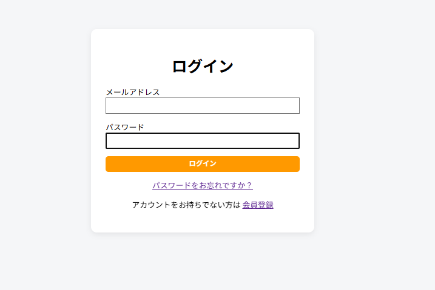
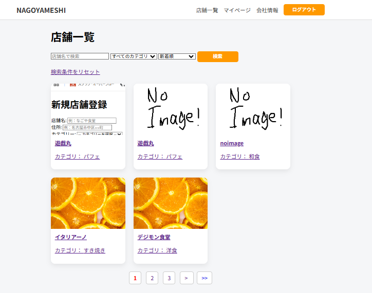
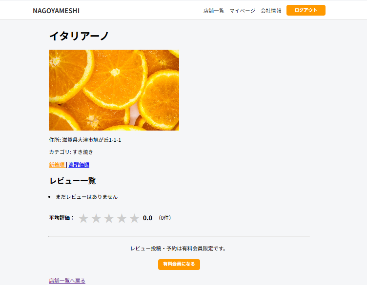
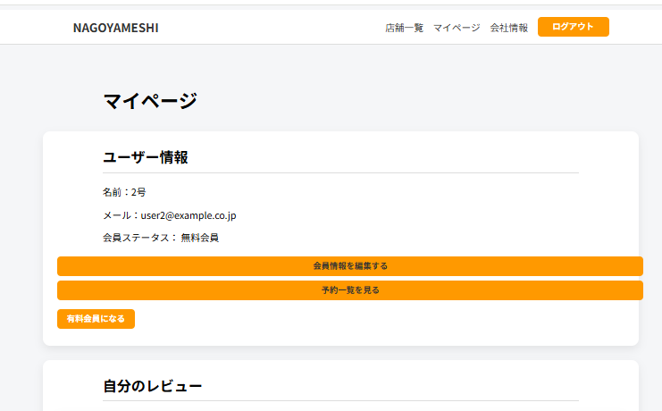
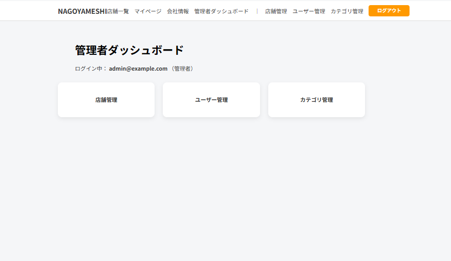

<h1 align="center">NAGOYAMESHI</h1>

<p align="center">
  
  
  
  
  
  
</p>

 Spring Bootを使用して開発した飲食店検索・予約サービスです。

 一般ユーザーと管理者で利用できる機能を分け、権限管理を実装しています。
 
また、Stripeを利用したサブスクリプション決済を導入しており、有料会員のみ予約・レビュー投稿が利用できる仕様になっています。

---

## 💻 使用技術

### 🖥️ バックエンド

* Java 21
* Spring Boot 4.0
* Spring Security
* Spring Data JPA

### 🎨 フロントエンド

* HTML
* CSS
* Thymeleaf
* JavaScript

### 🗄️ データベース

* MySQL

### 💳 外部サービス

* Stripe API

---

## ✨ 実装した機能

### 👤 ユーザー機能

* 会員登録
* メール認証
* ログイン・ログアウト
* パスワードリセット
* 会員情報編集

### 🏪 店舗機能

* 店舗検索
* カテゴリ検索
* 店舗一覧表示
* 店舗詳細表示

### 💗 お気に入り機能

* お気に入り登録
* お気に入り登録解除

### 📅 予約機能

* 店舗予約
* 予約キャンセル

### ⭐ レビュー機能

* レビュー投稿
* レビュー削除
* 星評価
* 重複レビュー防止機能

### 👨‍💼 管理者機能

* 店舗管理（登録・編集・削除）
* カテゴリ管理
* ユーザー管理

### 💳 有料会員機能

* Stripe決済
* 支払方法変更
* サブスクリプション解約
* 有料会員限定レビュー投稿
* 有料会員限定予約

---

## 📷 スクリーンショット

<table>
<tr>
<td align="center">

### ログイン画面

ユーザーがメールアドレスとパスワードでログインできます。



</td>

<td align="center">

### 店舗一覧

店舗検索やカテゴリ検索を利用して店舗を探せます。



</td>
</tr>

<tr>
<td align="center">

### 店舗詳細

店舗情報やレビューを確認し、予約・レビュー投稿ができます。



</td>

<td align="center">

### マイページ

会員情報の確認・編集や予約一覧の確認ができます。



</td>
</tr>
</table>

### 👨‍💼 管理者ダッシュボード

管理者専用画面から店舗・カテゴリ・ユーザーを管理できます。

<p align="center">

</p>
---

## 💡 アプリの特徴

* Spring Bootを使用して開発した飲食店検索・予約サービス
* 一般ユーザーと管理者で利用できる機能を分け、権限管理を実装
* 店舗検索・カテゴリ検索・お気に入り登録・レビュー投稿機能を実装
* Stripe APIを利用したサブスクリプション決済を導入し、有料会員限定機能を実装
* メール認証・パスワードリセット機能を実装し、安全なログイン機能を提供

---

## 🎮 セットアップ方法

### 前提環境

* Java 21
* Spring Boot 4.0
* MySQL
* Maven
* IDE（Eclipse Pleiadesで開発）
* Stripeのシークレットキーは環境変数 `STRIPE_SECRET_KEY` として設定してください。

### 起動手順

1. リポジトリをクローン

```bash
git clone https://github.com/you-mahha/nagoyameshi.git
```

2. MySQLでデータベースを作成

```text
nagoyameshi_db
```

3. `application.properties` を設定

```properties
spring.datasource.url=jdbc:mysql://localhost:3306/nagoyameshi_db
spring.datasource.username=root
spring.datasource.password=（各自の環境に合わせて設定）

stripe.secret-key=${STRIPE_SECRET_KEY}
```

4. EclipseなどのIDEでプロジェクトを開く

5. Spring Bootアプリケーションを実行

6. ブラウザで以下へアクセス

```text
http://localhost:8080
```

---

## 🚀 今後改善したい点

* Dockerを利用した開発環境の構築
* AWSへのデプロイ
* JUnitを利用したテストコードの追加
* レスポンシブデザインへの対応
* UI/UXの改善

## 👤 開発者

GitHub：<https://github.com/you-mahha>
